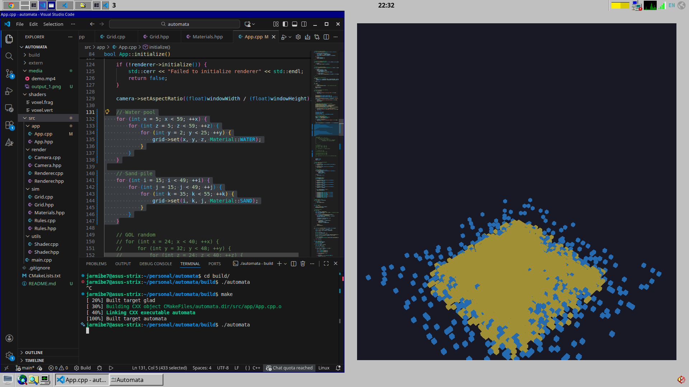
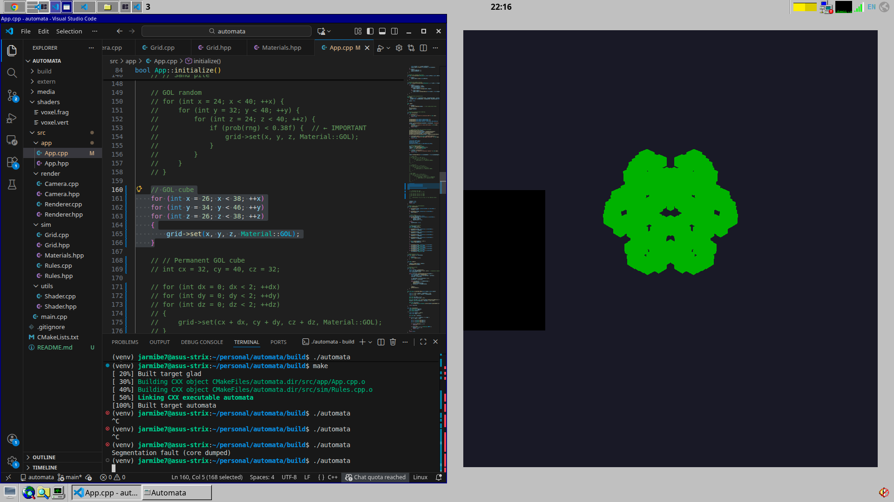

# Cellular Automata Exploration
#### Author: Jared Berry



This project was associated with ME 302: Artificial Life at Northwestern University.

#### Project Description
The goal of this project was to explore the emergent behavior of cellular automata. This project includes a 3D simulation of various cellular automata materials, including sand, water, and Conway's Game of Life. The simulation runs on the CPU using a double-buffered grid, while rendering is handled by GPU instanced voxels using modern OpenGL. All code is written in C++.

To build:
```
mkdir build
cd build
cmake ..
make
```

To run:
```
./automata
```

#### Project Structure
- media/
    * Contains photo and video demos.
- shaders/
    * Simple vertex and frag shaders 
- sim/
    * Grid: Voxel grid implementation.
    * Materials: Simple data structures for adding more cellular automata materials.
    * Rules: Rules dictating how each cellular automata material behaves.
- utils/
    * Rendering functionality

#### 3D Game of Life Rules
Conway's Game of Life doesn't work in 3D with its typical rules. I found the following rules to be relatively stable:
* Live cell: survives if it has 5–7 neighbors; otherwise dies.
* Empty cell: becomes alive if it has exactly 6 neighbors.

Resulting fractal structure:

